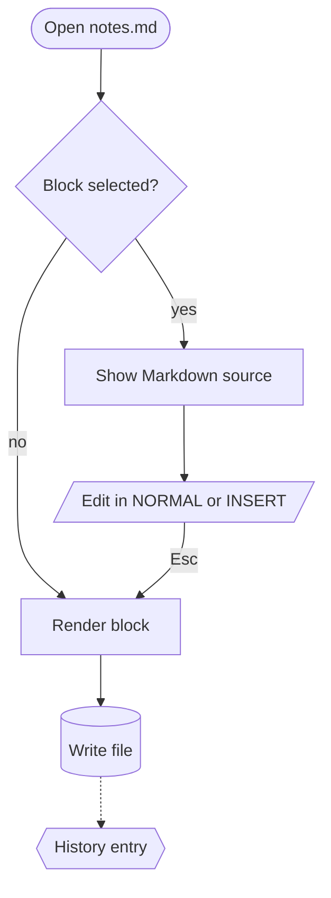
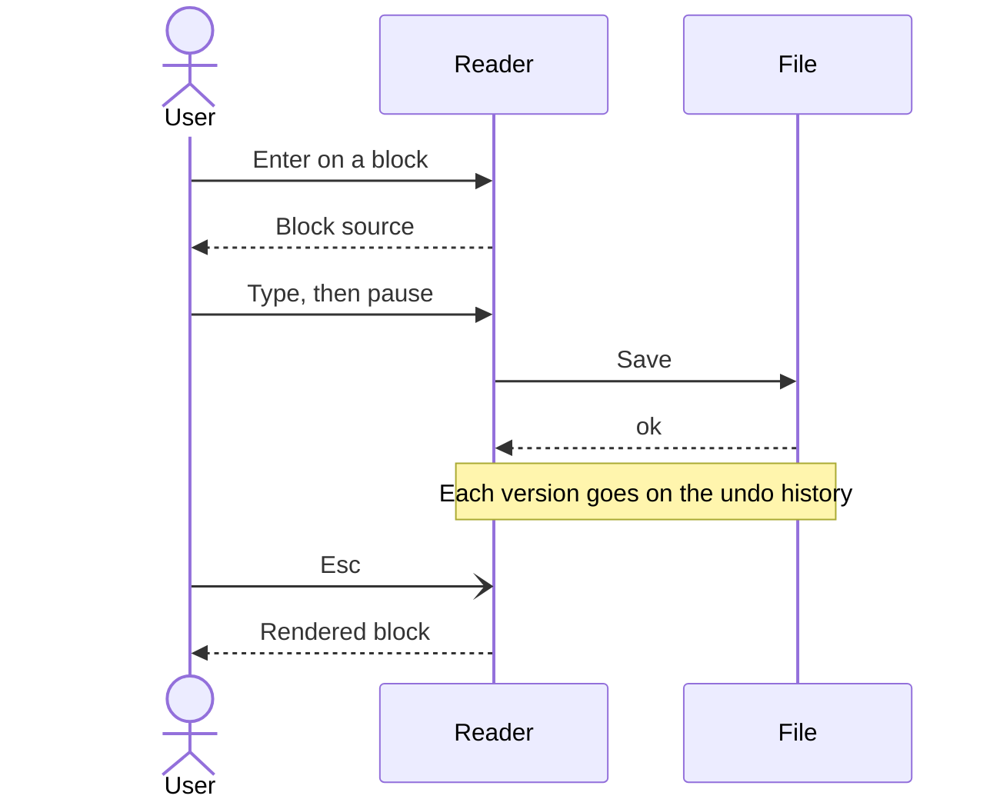
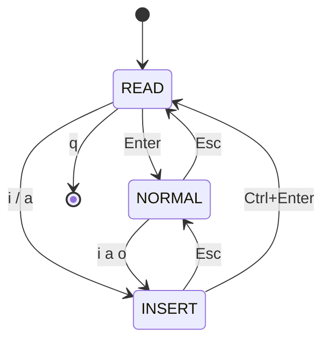

# Mermaid in bibmd

Fenced `mermaid` blocks are drawn as diagrams. Open one (`Enter`) to edit its source.

## Flowchart

```mermaid
flowchart TD
    A([Open notes.md]) --> B{Block selected?}
    B -- yes --> C[Show Markdown source]
    B -- no --> D[Render block]
    C --> E[/Edit in NORMAL or INSERT/]
    E -->|Esc| D
    D --> F[(Write file)]
    F -.-> G{{History entry}}
```

## Sequence diagram

```mermaid
sequenceDiagram
    actor U as User
    participant R as Reader
    participant F as File
    U->>R: Enter on a block
    R-->>U: Block source
    U->>R: Type, then pause
    R->>F: Save
    F-->>R: ok
    Note over R,F: Each version goes on the undo history
    U-)R: Esc
    R-->>U: Rendered block
```

## State diagram

```mermaid
stateDiagram-v2
    [*] --> READ
    READ --> NORMAL: Enter
    READ --> INSERT: i / a
    NORMAL --> INSERT: i a o
    INSERT --> NORMAL: Esc
    NORMAL --> READ: Esc
    INSERT --> READ: Ctrl+Enter
    READ --> [*]: q
```
